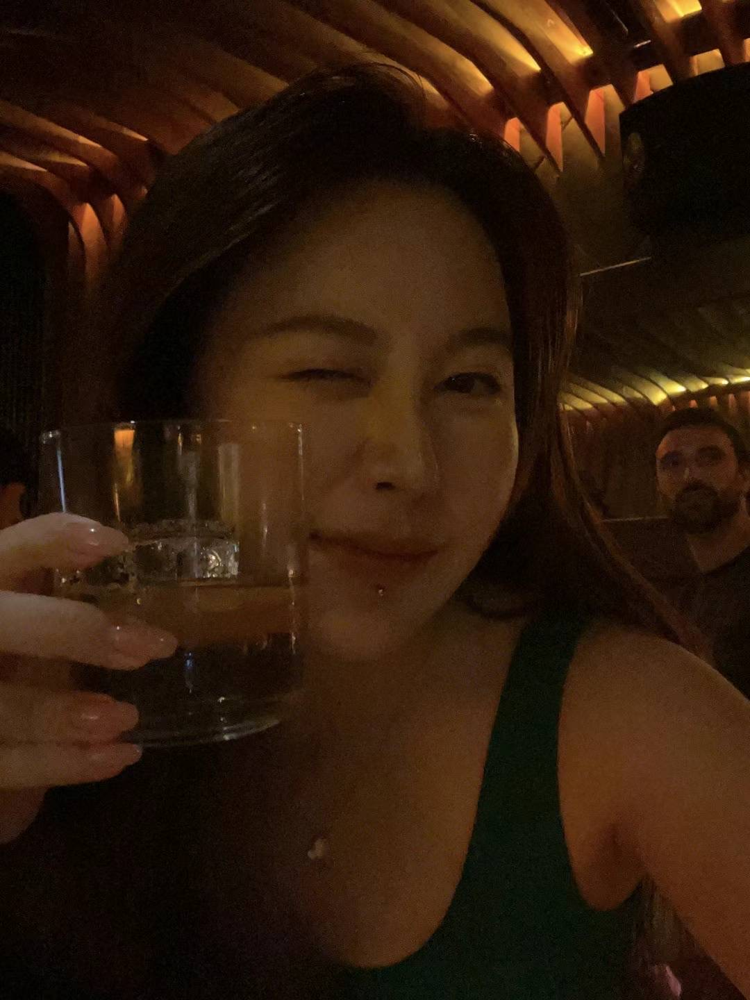

I'm Chuyun Ma, and my preferred name is Shannon. I'm doing my master's in HCID as an M2 student at UPSaclay now, following the completion of my first year of study at KTH in Sweden. I obtained my bachelor's in cybersecurity and worked for a certain time before my master's. 

I'm a rebel in my family. My parents, who hold traditional Chinese values, have always encouraged me to follow a predetermined path and prioritize stability and conventional life choices. Finding a decent job after acquiring a degree and giving birth to a child in a 'normal' marriage is their expectation. Their ideal scenario involves obtaining a degree, securing a stable job, and starting a family within a traditional marriage. While many perceive me as bold for leaving a good job, I recognize that I still have a conservative side. I yearn for different experiences and want to break away from my comfort zone to truly explore life's endless possibilities because I know there are lots of undone. 

Maybe I'll apply for another master, or to be a bartender or even a blogger. Everything is yet to settle now but the process of exploring myself is thrilling enough.

BTW, I'm definitely an alchoholic, I'd like to meet up with anybody who's interested in mixology&whisky🍸🥃

